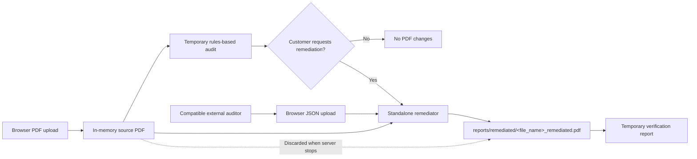

# PDF Accessibility Screening and Remediation

This is a **standalone Python application** that audits PDF files for common accessibility barriers and applies a limited set of deterministic remediations. The local workflow runs entirely on the user's computer and does not require Azure, an LLM, Microsoft Agent Framework, an API key, or an internet connection after its Python dependencies are installed.

The application uses **rules-based logic**, not generative AI. Its audit rules inspect the PDF object structure, metadata, extractable text, images, forms, and navigation features through `pypdf`. Its remediation rules make only predefined, non-destructive changes that can be applied safely without inventing document meaning.

## Accessibility-rule basis

The encoded screening policy was derived from a project-specific source document named `ADA Title II Web Accessibility.docx`. That document identifies PDF documents as in scope, calls for full PDF/UA conformance, references WCAG 2.1 Level AA and Section 508, and identifies requirements including:

- Text alternatives for non-text content
- Keyboard navigation and operation
- A minimum 4.5:1 text color-contrast ratio
- Semantic PDF structure consistent with PDF/UA expectations

The source policy document is intentionally excluded from this public repository. Its relevant screening requirements are represented in the application as named rules, and every finding identifies the source requirement used by that rule.

The automated audit reports the same 32 named rule areas shown by the Acrobat accessibility report: document properties, page-content tagging, forms, alternate text, tables, lists, and heading nesting. Each rule is reported as pass, fail, manual review, skipped, or not applicable. The checks are independently implemented with `pypdf`; they do not invoke or reproduce Adobe's proprietary checker, so results can differ where Acrobat uses undocumented logic.

The remediator can set a missing default language, add title metadata derived from the filename, enable display of the document title, and select structure-based tab order. For an untagged document, it can add a baseline structure tree that tags text objects as paragraphs, image draws as figures, and layout graphics as artifacts. Image-only pages receive a page-level Figure tag. It does not generate OCR text or alternate-text meaning, infer headings or tables, change visual contrast, or make legal compliance determinations.

### Acrobat-aligned rule coverage

| Category | Rules reported | Automatic remediation |
| --- | --- | --- |
| Document | Accessibility permission flag, Image-only PDF, Tagged PDF, Logical Reading Order, Primary language, Title, Bookmarks, Color contrast | Adds baseline tags, language, title, and title-display preference. OCR, bookmarks, reading order, permissions, and contrast remain unresolved or manual when they fail. |
| Page Content | Tagged content, Tagged annotations, Tab order, Character encoding, Tagged multimedia, Screen flicker, Scripts, Timed responses, Navigation links | Tags baseline page content and sets structure-based tab order. Annotation, encoding, multimedia, script, timing, flicker, and link issues are reported but are not rewritten automatically. |
| Forms | Tagged form fields, Field descriptions | Validates field tagging and accessible names. It does not invent missing field descriptions or restructure form widgets. |
| Alternate Text | Figures alternate text, Nested alternate text, Associated with content, Hides annotation, Other elements alternate text | Validates structure and associations. It does not invent meaningful alternate text. |
| Tables | Rows, TH and TD, Headers, Regularity, Summary | Validates existing table tags. It does not infer or rebuild table semantics. |
| Lists | List items, Lbl and LBody | Validates existing list hierarchy. It does not infer or rebuild lists. |
| Headings | Appropriate nesting | Validates heading-level order. It does not infer headings from visual formatting. |

The remediation results report includes every rule, including rules that already passed, were remediated, remain unresolved, require manual review, were skipped, or do not apply. A reported rule is not necessarily an automatically repairable rule.

> This tool is an automated screening and limited-remediation utility. It does not certify ADA, PDF/UA, WCAG, or Section 508 compliance and is not legal advice. Full conformance cannot be established by these automated checks. A qualified human review with assistive technology is required.

## Setup

Create and activate a Python 3.10+ virtual environment, then install dependencies:

    pip install -r requirements.txt

No Azure subscription, LLM, API key, or Microsoft Agent Framework configuration is required for the local three-script workflow.

## Run the complete workflow

    python pdf_accessibility_workflow.py

The command starts a local HTTP server on `127.0.0.1`, selects an available port, and opens the PDF upload page in the default browser. The terminal must remain running while the page is in use. This local URL is accessible only from the computer running the command.

The workflow uses three separate programs:

1. `pdf_accessibility_audit.py` audits a PDF and can write JSON plus HTML reports when run directly.
2. `pdf_accessibility_remediator.py` accepts a JSON report and creates a remediated PDF copy when run directly.
3. `pdf_accessibility_workflow.py` opens an upload page, audits the selected PDF, and waits. It invokes the remediator only after the user applies the generated audit or uploads a valid third-party remediation JSON report.

The complete workflow:

1. Starts without requiring a PDF command-line argument.
2. Accepts a PDF through the local browser page and processes it using memory and automatically deleted temporary files.
3. Creates the audit JSON and HTML in temporary storage and displays the audit report.
4. Waits for the user to apply the generated audit or upload a third-party remediation JSON report in the browser.
5. Validates uploaded JSON in temporary storage without retaining it.
6. Only after either remediation action, saves `reports/remediated/<original-name>_remediated.pdf`, re-audits it temporarily, and displays the remediation results.
7. Provides a **Home** button on the audit and remediation pages that clears the current upload and returns to the PDF upload screen.

The complete workflow persists only its remediated PDF:

```text
reports/
└── remediated/     Remediated PDF output
```

The entire `reports/` tree is excluded from Git because remediated PDFs can contain customer information. Uploaded source PDFs, generated audit data, uploaded remediation JSON, and HTML reports are discarded when the workflow server stops.

## Workflow Diagram

The JSON audit report is the handoff contract between auditing and remediation. Customers can generate it with the included rules-based auditor or supply a compatible report from another application. The standalone remediator reads that persisted JSON together with the associated source PDF. It never overwrites the source PDF: when remediation is requested, it creates a new copy and then re-audits that copy to document successful, unresolved, and manual-review items.



The two input paths shown above are supported as follows:

- **Included audit path:** the complete workflow inspects the uploaded source PDF and keeps its JSON contract and HTML report temporary.
- **External audit path:** another application may provide either the canonical JSON contract or the supported Markdown-report JSON format through the browser upload.
- **Approval boundary:** the complete interactive workflow offers **Yes, apply remediation** for the generated audit and **Upload remediation JSON file** for a third-party report. Either action is an explicit remediation request. Running the standalone remediator is also an explicit request.
- **Output behavior:** only the remediated PDF is written under `reports/remediated`. The uploaded original is never written to a persistent application path.
- **Home navigation:** selecting **Home** clears the current in-memory workflow state and returns to the initial PDF upload screen.
- **Verification:** the remediated copy is audited again, and the temporary HTML result identifies remediated, unresolved, and manual-review findings.

Keep the terminal running while viewing the report. Press Ctrl+C when finished. Use `--no-open` to print the local report URL without automatically opening the browser.

The browser accepts PDF files up to 20 MB and remediation JSON files up to 5 MB. A remediation report must satisfy either the canonical `findings` schema or the supported 32-rule Markdown-report schema. Invalid uploads are rejected. The uploaded report controls which findings are remediated, while the PDF uploaded in the browser remains the source document.

Automatic remediation applies only deterministic PDF/UA-related updates supported by the source policy: default language, title metadata, title display preference, structured tab order, and baseline paragraph, figure, and artifact tagging for untagged documents. After remediation, all 32 rules appear in the result report as already passed, remediated, unresolved, manual, skipped, or not applicable. The application does **not** invent OCR text or meaningful text alternatives, infer tables/headings, alter visual contrast, or certify ADA compliance.

Run only the audit:

    python pdf_accessibility_audit.py "document.pdf" --no-open

Run only remediation, using the audit JSON:

    python pdf_accessibility_remediator.py "reports/incoming/accessibility-report-document.json" --pdf "pdf_files/document.pdf" --no-open

The audit command writes its HTML and JSON outputs under `reports/audits`. The remediation command writes the new PDF and its HTML result under `reports/remediated`. Explicit output options still override these defaults.

Default standalone-script outputs are:

- `reports/audits/accessibility-report.html`
- `reports/audits/accessibility-report-<file_name>.json`
- `reports/remediated/<file_name>_remediated.pdf`
- `reports/remediated/<file_name>-remediation.html` for the standalone remediator

The complete workflow saves only `reports/remediated/<file_name>_remediated.pdf`.

Running the tools again for the same filename replaces the corresponding default output. Use the output options when each run must be retained separately.

An audit JSON generated by another application can be used when it follows the same JSON structure emitted by `pdf_accessibility_audit.py`. Store external inputs under `reports/incoming`. The remediator also accepts the external Markdown-report format used by `reports/incoming/T00700020111-remediation.json`:

```json
{
    "fileName": "document.pdf",
    "remediationReport": "| Rule | Severity | Status |\n|---|---|---|\n..."
}
```

The Markdown report must contain exactly one recognizable status row for each of the 32 supported rule areas. Rule names are normalized to the local `ACR-*` identifiers, statuses are converted to the local vocabulary, and details from the seven-column failures table are retained when present. Missing rules, duplicate rules, and unknown statuses are rejected instead of being inferred. Canonical JSON reports with a structured `findings` array continue to load unchanged.

### ADA Checker remediation API

The workflow server exposes `POST /api/remediate` for integration with the ADA Accessibility Checker. The request must use `multipart/form-data` with:

- `file`: the original PDF, up to 20 MB.
- `remediation_report`: the checker's JSON report, up to 5 MB.

The report filename must match the uploaded PDF and must contain all 32 supported rule rows. A successful request returns the remediated PDF as `application/pdf`. Source PDFs, report JSON, and intermediate files are processed in an automatically deleted temporary directory; the API response is not written to the application output folder.

Set `REMEDIATOR_API_KEY` to require callers to send the same value in the `X-Remediator-Key` header. The API remains unauthenticated when the setting is empty, which is suitable only for local development. Azure deployments should provide this value through a secure deployment parameter or secret-backed application setting.

When `--pdf` is omitted, name canonical reports using one of these forms so the remediator can infer the PDF filename:

- `accessibility-report-document.json` for `document.pdf`
- `accessibility-report-document.pdf.json` for `document.pdf`

If the PDF is elsewhere or the external JSON's stored `file` path came from another computer, provide the PDF explicitly:

    python pdf_accessibility_remediator.py "reports/incoming/accessibility-report-document.json" --pdf "pdf_files/document.pdf" --no-open

Output paths remain optional overrides:

    python pdf_accessibility_remediator.py "reports/incoming/accessibility-report-document.json" --pdf "pdf_files/document.pdf" --output "custom/document_remediated.pdf" --report "custom/remediation.html" --no-open

The remediator reads the persisted JSON file before opening and modifying the associated PDF. It does not rerun the original audit in place of that input. After writing the remediated copy, it audits the new copy to report which findings changed.

Choose a custom complete-workflow output path:

    python pdf_accessibility_workflow.py --remediated-output "custom/document_remediated.pdf"

## Exit codes

- `0`: audit completed, even if accessibility failures were found
- `1`: PDF parsing or unexpected audit error
- `2`: invalid input, inaccessible/encrypted PDF, or output error

The numerical score covers only automated checks. Manual-review items are excluded from the score and must not be treated as passed.

## Deploy to Azure with GitHub Copilot

The repository includes `Dockerfile.azure` and Bicep infrastructure under `infra/` for an Azure App Service Linux container deployment. A repository user can clone the project, open it in VS Code with GitHub Copilot, authenticate to Azure, and ask Copilot to deploy the application into the user's own subscription.

Suggested prompt:

> Deploy this repository to my Azure subscription using the App Service Linux container architecture in `infra/`. Generate globally unique resource names for my deployment, use the B1 Linux plan with one instance, build `Dockerfile.azure` in a private Azure Container Registry, and use the App Service managed identity for image pulls. Keep HTTPS-only access, TLS 1.2 or later, the `/health` health check, FTP disabled, and SCM basic publishing credentials disabled. Validate both `/health` and the complete PDF upload, audit, remediation, and download workflow. Do not deploy this application with Azure Functions Flex Consumption.

Before deployment, the user needs:

- An Azure subscription and permission to create resource groups and resources.
- Permission to create role assignments. **Owner** is sufficient; **Contributor** plus **Role Based Access Control Administrator** is another common combination.
- Azure CLI authentication for the intended tenant and subscription.
- Access to App Service and Azure Container Registry in the selected region, including sufficient quota.
- VS Code and GitHub Copilot with agent capabilities if Copilot will perform the deployment.

Copilot should inspect and adapt the included infrastructure rather than reuse its example names. Azure Container Registry, App Service, and Key Vault names must be globally unique. The checked-in parameter file contains example deployment metadata and is not an authorization credential.

The expected deployment creates:

- One Basic Azure Container Registry containing the application image.
- One Linux B1 App Service plan and one containerized web app.
- One Log Analytics workspace and Application Insights resource.
- One Key Vault.
- Managed-identity role assignments for private container image pulls and Key Vault access.

The deployed endpoint is intentionally anonymous for a controlled pilot. Uploaded source PDFs and generated reports are processed in memory or temporary storage. Remediated PDFs use the container's ephemeral filesystem and should be downloaded promptly. Keep the app at one instance until workflow sessions and generated output are moved to shared storage.

The example architecture was estimated at approximately **$17.41 USD per month** in `westus2` when created, primarily for the Linux B1 App Service plan and Basic Container Registry. Pricing varies by agreement, region, currency, usage, and date; review the current Azure estimate before approving deployment.

Cloning or pushing this repository does not create or update Azure resources automatically. There is no GitHub Actions deployment workflow. A GitHub push changes only the repository; publishing a new application version requires an explicit Azure container build and App Service update performed by the user, Copilot, or a future CI/CD workflow.

## Repository privacy

The `.gitignore` excludes PDFs, Word policy documents, generated audit/remediation reports, virtual environments, local Function settings, and machine-specific deployment validation files. This prevents new customer documents and local credentials from being added accidentally. If files were tracked before these rules were added, remove them from the Git index before publishing.

The three runtime programs do not depend on test modules:

- `pdf_accessibility_audit.py`
- `pdf_accessibility_remediator.py`
- `pdf_accessibility_workflow.py`

Choose and add an appropriate `LICENSE` before making the repository public if others should be allowed to copy, modify, or redistribute the code.
