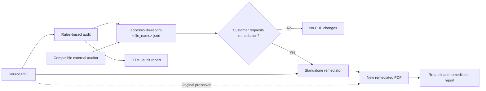

# PDF Accessibility Screening and Remediation

This is a **standalone Python application** that audits PDF files for common accessibility barriers and applies a limited set of deterministic remediations. The local workflow runs entirely on the user's computer and does not require Azure, an LLM, Microsoft Agent Framework, an API key, or an internet connection after its Python dependencies are installed.

The application uses **rules-based logic**, not generative AI. Its audit rules inspect the PDF object structure, metadata, extractable text, images, forms, and navigation features through `pypdf`. Its remediation rules make only predefined, non-destructive changes that can be applied safely without inventing document meaning.

## Accessibility-rule basis

The encoded screening policy was derived from a project-specific source document named `ADA Title II Web Accessibility.docx`. That document identifies PDF documents as in scope, calls for full PDF/UA conformance, references WCAG 2.1 Level AA and Section 508, and identifies requirements including:

- Text alternatives for non-text content
- Keyboard navigation and operation
- A minimum 4.5:1 text color-contrast ratio
- Semantic PDF structure consistent with PDF/UA expectations

The source policy document is intentionally excluded from this public repository. Its relevant screening requirements are represented in the application as named rules, and every finding identifies the source requirement used by that rule.

The automated audit checks PDF tagging, logical structure, document language, title metadata, title-display preferences, bookmarks, extractable text, likely scanned pages, figure alternatives, and form-field names. Requirements that cannot be established reliably through static inspection—such as semantic accuracy, reading order, heading quality, table associations, meaningful alternate text, keyboard usability, screen-reader behavior, and visual contrast—are reported as manual reviews.

The remediator can set a missing default language, add title metadata derived from the filename, enable display of the document title, and select structure-based tab order. For a document in which every page is an image with no extractable text, it can add a minimal `Document > Figure` structure tree and associate each page's existing content with its Figure tag. It does not generate OCR text or alternate-text meaning, infer headings or tables, change visual contrast, or make legal compliance determinations.

> This tool is an automated screening and limited-remediation utility. It does not certify ADA, PDF/UA, WCAG, or Section 508 compliance and is not legal advice. Full conformance cannot be established by these automated checks. A qualified human review with assistive technology is required.

## Setup

Create and activate a Python 3.10+ virtual environment, then install dependencies:

    pip install -r requirements.txt

No Azure subscription, LLM, API key, or Microsoft Agent Framework configuration is required for the local three-script workflow.

## Run the complete workflow

    python pdf_accessibility_workflow.py "path/to/document.pdf"

The workflow uses three separate programs:

1. `pdf_accessibility_audit.py` audits the source PDF and writes JSON plus HTML reports.
2. `pdf_accessibility_remediator.py` accepts that JSON report and creates a remediated PDF copy.
3. `pdf_accessibility_workflow.py` runs the audit, opens its report, and waits. It invokes the remediator with the persisted JSON only after the **Yes, apply remediation** button is clicked.

The complete workflow:

1. Preserves the original PDF.
2. Writes and displays the audit report without creating a remediated PDF.
3. Writes `accessibility-report-<file_name>.json` as the contract between the two stages.
4. Waits for explicit confirmation in the browser.
5. Only after confirmation, creates `<original-name>_remediated.pdf`, re-audits it, and displays the remediation results.

## Workflow Diagram

The JSON audit report is the handoff contract between auditing and remediation. Customers can generate it with the included rules-based auditor or supply a compatible report from another application. The standalone remediator reads that persisted JSON together with the associated source PDF. It never overwrites the source PDF: when remediation is requested, it creates a new copy and then re-audits that copy to document successful, unresolved, and manual-review items.

The two input paths shown above are supported as follows:

- **Included audit path:** `pdf_accessibility_audit.py` inspects the source PDF and writes both the JSON contract and an HTML report.
- **External audit path:** another application may provide the JSON contract if it uses the expected schema and `accessibility-report-<file_name>.json` naming convention.
- **Approval boundary:** the complete interactive workflow waits for the customer to click the remediation button. Running the standalone remediator is itself the explicit remediation request.
- **Output behavior:** remediation creates `<file_name>_remediated.pdf`; the original remains unchanged.
- **Verification:** the remediated copy is audited again, and the resulting HTML report identifies remediated, unresolved, and manual-review findings.

Keep the terminal running while viewing the report. Press Ctrl+C when finished. Use `--no-open` to print the local report URL without automatically opening the browser.

Automatic remediation applies only deterministic PDF/UA-related updates supported by the source policy: default language, title metadata, title display preference, structured tab order, and minimal page-level Figure tagging for fully image-only documents. It does **not** invent OCR text or meaningful text alternatives, infer tables/headings, alter visual contrast, or certify ADA compliance. The remediation report cites the controlling source requirement and identifies unsuccessful and manual work.

Run only the audit:

    python pdf_accessibility_audit.py "document.pdf" --output "reports/audit.html" --json "reports/audit.json" --no-open

Run only remediation, using the audit JSON:

    python pdf_accessibility_remediator.py "reports/accessibility-report-document.json" --no-open

For that command, place `document.pdf` beside `accessibility-report-document.json`. The remediator infers the source PDF name, writes `document_remediated.pdf` beside it, and writes `accessibility-report-document-remediation.html` beside the JSON report.

An audit JSON generated by another application can be used when it follows the same JSON structure emitted by `pdf_accessibility_audit.py`. Name it using one of these forms:

- `accessibility-report-document.json` for `document.pdf`
- `accessibility-report-document.pdf.json` for `document.pdf`

If the PDF is elsewhere or the external JSON's stored `file` path came from another computer, provide the PDF explicitly:

    python pdf_accessibility_remediator.py "incoming/accessibility-report-document.json" --pdf "pdfs/document.pdf" --no-open

Output paths remain optional overrides:

    python pdf_accessibility_remediator.py "incoming/accessibility-report-document.json" --pdf "pdfs/document.pdf" --output "results/document_remediated.pdf" --report "results/remediation.html" --no-open

The remediator reads the persisted JSON file before opening and modifying the associated PDF. It does not rerun the original audit in place of that input. After writing the remediated copy, it audits the new copy to report which findings changed.

Choose all complete-workflow output paths:

    python pdf_accessibility_workflow.py "document.pdf" --audit-json "reports/accessibility-report-document.json" --audit-report "reports/audit.html" --remediated-output "reports/document_remediated.pdf" --remediation-report "reports/remediation.html" --no-open

## Exit codes

- `0`: audit completed, even if accessibility failures were found
- `1`: PDF parsing or unexpected audit error
- `2`: invalid input, inaccessible/encrypted PDF, or output error

The numerical score covers only automated checks. Manual-review items are excluded from the score and must not be treated as passed.

## Azure Functions deployment

The project also includes a Python v2 Azure Functions wrapper in `function_app.py`. It provides one function-key-protected route with actions for upload, audit, remediation, and download. Source PDFs and audit JSON reports are stored in a private `pdf-jobs` Blob container; the remediation action downloads both and passes the JSON to the remediator. A random per-job token is additionally required for remediation and download.

Required Function App settings:

- `PDF_STORAGE_ACCOUNT_URL`: Blob endpoint, such as `https://<account>.blob.core.windows.net`
- `PDF_CONTAINER_NAME`: defaults to `pdf-jobs`
- `PDF_MAX_UPLOAD_BYTES`: defaults to `20971520` (20 MB)
- `AzureWebJobsStorage__accountName`: hosting storage account name
- `AzureWebJobsStorage__credential`: `managedidentity`

The Function App's system-assigned identity requires **Storage Blob Data Contributor** on `pdf-jobs` for application files and on the hosting storage account for Functions host metadata and secrets. Do not retain an `AzureWebJobsStorage` account-key connection string when storage account key access is disabled. Open the endpoint using a Function or host key:

    https://<function-app>.azurewebsites.net/api/pdf-accessibility?code=<key>

Temporary job files contain uploaded documents. The deployed storage policy in `.azure/storage-lifecycle-policy.json` deletes block blobs under `pdf-jobs/` one day after their last modification without affecting the Function deployment package container.

## Repository privacy

The `.gitignore` excludes PDFs, Word policy documents, generated audit/remediation reports, virtual environments, local Function settings, and machine-specific deployment validation files. This prevents new customer documents and local credentials from being added accidentally. If files were tracked before these rules were added, remove them from the Git index before publishing.

The three runtime programs do not depend on test modules:

- `pdf_accessibility_audit.py`
- `pdf_accessibility_remediator.py`
- `pdf_accessibility_workflow.py`

Choose and add an appropriate `LICENSE` before making the repository public if others should be allowed to copy, modify, or redistribute the code.
